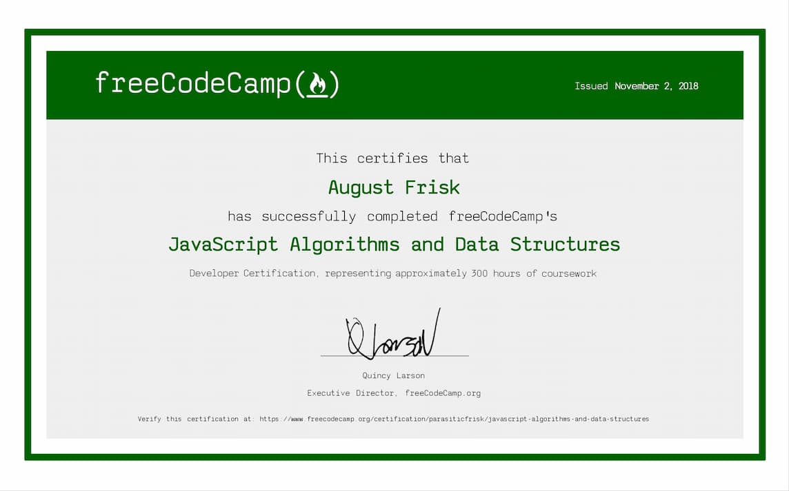

 

 

As part of this certificate, the following projects met each individual project requirements and passed all of freeCodeCamp's automated test suites:

 

- [Palindrome Checker](https://parasiticfrisk.github.io/javascript-algorithms-and-data-structures/palindrome.html)
- [Roman Numeral Converter](https://parasiticfrisk.github.io/javascript-algorithms-and-data-structures/roman_num.html)
- [Caesars Cipher](https://parasiticfrisk.github.io/javascript-algorithms-and-data-structures/cipher.html)
- [Telephone Number Validator](https://parasiticfrisk.github.io/javascript-algorithms-and-data-structures/phone_valid.html)
- [Cash Register](https://parasiticfrisk.github.io/javascript-algorithms-and-data-structures/register.html)